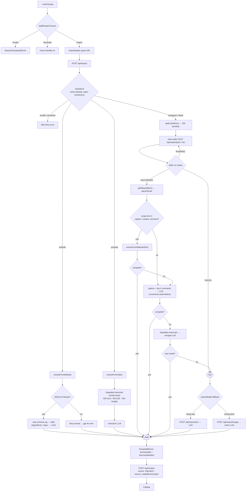
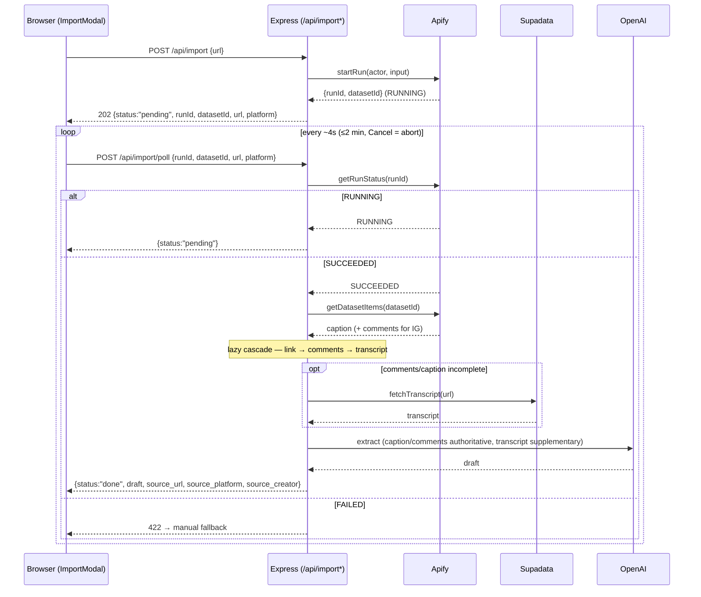

# KitchenPal — Recipe Import (As-Built Spec)

**Status:** Shipped on `dev` (websites + YouTube + Instagram + TikTok + paste + screenshot).
**Scope:** This document describes the import feature **as actually built**. It supersedes the
original [IMPORT_SPEC.md](IMPORT_SPEC.md), whose yt-dlp + Whisper + Python design proved infeasible on
Vercel Hobby and was replaced by hosted APIs (Supadata, Apify).

Import is the product's **headline feature** — the center of gravity shifted from AI generation toward
import-and-store. AI generation/modification still exist but are secondary.

---

## 1. Entry points

`+ Add Recipe` (Catalog) opens **`AddRecipeChooser`** — three intake options, **import-first**:

| Option | Action |
|---|---|
| **Import** | Opens `ImportModal` (paste a URL, or fall back to paste-text / screenshot) |
| **Create** | The manual `RecipeEditForm` (`AddRecipeModal`) |
| **Generate** | Routes to Home's AI GenBar |

Every import path produces a **draft** that is reviewed/edited in the shared
[`RecipeEditForm`](../../apps/web/src/components/RecipeEditForm.tsx) and only persisted when the user
hits **Save** (→ `POST /api/recipes`, `source: "imported"`). Import routes never write to the DB.

---

## 2. Source routing

`classifyUrl` ([url.ts](../../apps/api/src/lib/import/url.ts)) normalizes the URL (strips
`utm_*`/`igsh`/`si`/`fbclid` + fragment), **rejects shorteners** (`bit.ly`, `t.co`, … → 400), and
classifies the host:

| Source | Pipeline | Sync/Async | Where the recipe lives |
|---|---|---|---|
| **Website** | JSON-LD (schema.org `Recipe`, walks `@graph`) → map; else strip chrome → `gpt-4o-mini` | **Sync** | structured page data |
| **YouTube** | **Supadata** transcript (`mode=auto`) → extraction LLM | **Sync** (Supadata 200/202-poll inside the request) | spoken audio |
| **Instagram** | **Apify** `apify/instagram-scraper` → caption + comments → lazy cascade | **Async** (start + client poll) | caption / **pinned comment** |
| **TikTok** | **Apify** `clockworks/tiktok-scraper` → **description** → lazy cascade | **Async** (start + client poll) | the **description** (not comments) |
| **Paste text** | `POST /api/import/text` → extraction LLM | Sync | manual fallback, any platform |
| **Screenshot** | `POST /api/import/image` → `gpt-4o-mini` **vision** | Sync | manual fallback, image (not stored) |

Why hosted APIs instead of the original yt-dlp/Whisper plan: Vercel Hobby can't run heavy binaries,
AWS IPs get blocked by YT/IG, and the 60s function cap is too tight. **Supadata** returns a transcript
(existing captions or AI-generated) — replacing both yt-dlp and Whisper. **Apify** scrapes the
caption/comments/description that a transcript can't see.

---

## 3. Architecture diagram



`complete` = the draft has **≥2 ingredients AND ≥1 step** (`isComplete`). The cascade stops at the
first complete recipe; otherwise it keeps the best partial and only 422s if nothing usable is found.

---

## 4. Async start + poll (Instagram / TikTok)

Apify actor runs take 20–60s+ — longer than Vercel's 60s function cap allows us to block. So we
**never wait** inside one request: `POST /api/import` *starts* the run and returns its ids; the
browser polls; the poll that finds the run done fetches data + extracts (all under 60s). Stateless —
the client carries `runId`/`datasetId`, **no DB**, **no webhook** (the preview is SSO-protected and
unreachable by Apify).



Website + YouTube return `{status:"done", draft, …}` synchronously; `/api/import` returns a
discriminated `done | pending` union.

---

## 5. Per-source mechanics

### Website — [website.ts](../../apps/api/src/lib/import/website.ts)
Native `fetch` (8s timeout, browser UA) → `cheerio`. Find `<script type="application/ld+json">`,
walk objects + `@graph` for `@type: "Recipe"` → map (`name`, `description`, `recipeIngredient`,
`recipeInstructions` incl. `HowToStep`/`HowToSection`, ISO-8601 `totalTime`, `recipeYield`,
keywords/cuisine/category → tags, `author.name` → creator). If JSON-LD is missing/incomplete → strip
`nav/footer/script/style/aside`, take `<article>`/`<main>`/`<body>`, send to `gpt-4o-mini`.
Ingredient strings: **regex-first → one batched `gpt-4o-mini` call** for the remainder
([ingredients.ts](../../apps/api/src/lib/import/ingredients.ts)).

### YouTube — [video.ts](../../apps/api/src/lib/import/video.ts) + [supadata.ts](../../apps/api/src/lib/supadata.ts)
`GET https://api.supadata.ai/v1/transcript?url=&text=true&mode=auto` (header `x-api-key`). `200` =
sync transcript; `202` = `{jobId}` → poll `GET /v1/transcript/{jobId}` within a ~30s budget. Transcript
→ `IMPORT_EXTRACT_SYSTEM_PROMPT`.

### Instagram / TikTok — [social.ts](../../apps/api/src/lib/import/social.ts) + [apify.ts](../../apps/api/src/lib/apify.ts)
Apify REST: `startRun` (`POST /v2/acts/{actor}/runs`), `getRunStatus` (`GET /v2/actor-runs/{id}`),
`getDatasetItems` (`GET /v2/datasets/{id}/items`).
- **Instagram** → `apify~instagram-scraper`: `caption`, `latestComments[]` (`{ownerUsername, text, likesCount}`),
  `ownerUsername`. Comments ranked **creator-first** (`isCreator = author === owner`) then by likes,
  capped at **top 5**.
- **TikTok** → `clockworks~tiktok-scraper` (metadata only, downloads off): the recipe is in the
  **description** (`text`); `authorMeta.name` is the creator. **No comments** (TikTok recipes aren't in
  comments) — the cascade uses the description, then the transcript.

The merged extraction uses `IMPORT_SOCIAL_SYSTEM_PROMPT`: **caption + comments are authoritative**;
the **transcript is supplementary** (filler) and must never override the written recipe.

### Paste / Screenshot — [routes/import.ts](../../apps/api/src/routes/import.ts)
`POST /api/import/text` (any platform) and `POST /api/import/image` (multer 4MB; base64 data URL →
`callOpenAIVisionJson` `gpt-4o-mini`; image **never stored**; optional `comment` = extraction
context). Both reuse the same draft shape and review/save flow.

---

## 6. The lazy cascade (Instagram / TikTok)

Run after a successful Apify scrape; stop at the first **complete** recipe (≥2 ingredients + ≥1 step);
keep the best partial; 422 if nothing usable. Cheapest/most-accurate → most expensive:

1. **Link** — first non-social URL in the caption or the **creator's own comment** →
   `extractFromWebsite(link)` (reuse the website pipeline; often JSON-LD; follows shortener redirects).
   *Rationale: a creator's own blog link is the highest-quality, structured source.*
2. **Caption + top-5 comments** → extraction LLM (comments authoritative). *This is where IG recipes
   usually are (pinned comment) and where TikTok descriptions land.*
3. **Supadata transcript** (only paid for here) → re-extract merged with caption/comments.
4. **422** → UI auto-switches to **Paste text / Screenshot**.

This "lazy merge" exploits the premise that the recipe is usually written (comment/caption/link), so
most imports never pay Supadata's transcript credit/latency — and it's safest against the 60s cap.

---

## 7. Data model

[schema.prisma](../../apps/api/prisma/schema.prisma) `Recipe` (migration `add_recipe_import_columns`):
`sourceUrl` (`source_url`), `sourcePlatform` (`source_platform`), `sourceCreator` (`source_creator`),
all nullable. `source` enum gained `"imported"`. Imported recipes carry attribution; the
[`SourceAttribution`](../../apps/web/src/components/SourceAttribution.tsx) strip ("From {creator} ·
{host}", linked) shows in the draft and in `RecipeModal` for `source === 'imported'`.

---

## 8. API surface — [routes/import.ts](../../apps/api/src/routes/import.ts)

| Route | Returns |
|---|---|
| `POST /api/import {url}` | website/YouTube → `{status:"done", draft, source_*}`; IG/TikTok → `202 {status:"pending", runId, datasetId, url, platform}` |
| `POST /api/import/poll {runId, datasetId, url, platform}` | `{status:"pending"}` \| `{status:"done", draft, source_*}` \| `422` |
| `POST /api/import/text {text, source_*?}` | `{draft, source_*}` |
| `POST /api/import/image` (multipart: `file`, `comment?`, `source_*?`) | `{draft, source_*}` |

Frontend wrappers in [lib/import.ts](../../apps/web/src/lib/import.ts): `importFromUrl` (returns the
`done|pending` union), `pollImport`, `importFromText`, `importFromImage`. The
[`ImportModal`](../../apps/web/src/components/ImportModal.tsx) drives `entry → extracting (timed
checklist + Cancel; polls IG/TikTok) → draft`, with a paste/screenshot fallback on any non-400 error.

---

## 9. Timeouts, budgets & the 60s cap

| Call | Budget |
|---|---|
| OpenAI client (default) | 30s, `maxRetries: 1` |
| Import extraction (override, single attempt `maxRetries:0`) | website/text **25s**, video **20s**, vision **30s** |
| Supadata | per-call ~25s; **total transcript budget ~30s** (then 504 → fallback) |
| Apify HTTP call | 15s |
| Multer upload | 4MB (Vercel ~4.5MB body cap) |

The 9s OpenAI client default (from the retired Vercel 10s cap) was raised to 30s after live testing
showed extraction runs ~10–18s → spurious 504s. **Async poll** removes the cap pressure for IG/TikTok
entirely; YouTube + website stay synchronous within the budgets above.

---

## 10. Keys & fail-soft

`SUPADATA_API_KEY` (YouTube + transcript fallback) and `APIFY_TOKEN` (IG/TikTok) are read **at call
time**, never at module load — a missing key disables **only that source** (HttpError → manual
fallback), not the whole serverless function. (Contrast `SUPABASE_*`/`OPENAI_API_KEY`, which are core
and throw at import.) One Apify account token works for all actors; Apify store actors are
pay-per-result (~pennies/import; free $5/mo credits). See [STARTUP.md](../../STARTUP.md) items 10–11.

---

## 11. Error handling & fallbacks

| Failure | HTTP | UX |
|---|---|---|
| Invalid URL / shortener | 400 | inline error on the input |
| Website unreachable / blocked / no recipe | 422 | auto-offer Paste text / Screenshot (URL pre-filled) |
| Transcript unavailable / Supadata limit / budget exceeded | 422 / 429 / 504 | manual fallback |
| Apify run FAILED / no recipe in post | 422 | manual fallback |
| Missing `SUPADATA_API_KEY` / `APIFY_TOKEN` | 500 (that source only) | manual fallback; rest of app unaffected |
| `{empty:true}` extraction | 422 | "couldn't find a recipe" → manual fallback |
| User cancels | — | abort the in-flight fetch/poll, return to entry |

The frontend treats **any non-400** error from `/api/import` as "switch to the manual fallback."

---

## 12. Decisions log (wired in)

- **[2026-05-28] Import is the new center of gravity** — `AddRecipeChooser` (Import/Create/Generate,
  import-first); drafts reviewed in `RecipeEditForm`, saved via existing `POST /api/recipes`.
- **[2026-05-28] Data model** — 3 nullable `source_*` columns + `"imported"` source value.
- **[2026-05-28] Website** — JSON-LD first (`@graph` walk), HTML→LLM fallback; ingredients regex→LLM.
- **[2026-05-29] Screenshot fallback** — `gpt-4o-mini` vision; image never stored; `comment` as context.
- **[2026-05-29] Video via Supadata, NOT yt-dlp/Whisper** — `mode=auto`; 200 sync / 202 poll under 60s.
- **[2026-05-29] OpenAI timeout 9s→30s** (client) + per-call import overrides (single attempt).
- **[2026-05-29] Stage 7 deploy** — single Vercel function, Hobby, `maxDuration: 60`.
- **[2026-05-30] IG/TikTok via Apify, async start + poll, lazy cascade** — caption/comments
  authoritative over transcript; stateless (no DB/webhook); IG uses comments, **TikTok uses the
  description**.

---

## 13. Out of scope / deferred

- **SSE progress** — replaced by a timed client-side checklist (single JSON response / poll). The SSE
  upgrade rides along if/when it's worth it.
- **TikTok comments** — TikTok recipes are in the description, so comments aren't scraped.
- **Multi-hop link aggregators** (Linktree → real recipe) — a Linktree link simply fails
  `extractFromWebsite` and the cascade falls through.
- **Webhooks** — not usable while the preview is SSO-protected; client polling instead.
- **Background workers** — the async poll already beats the 60s cap; revisit only if needed.

---

## 14. File map

```
apps/api/src/
  lib/
    apify.ts            startRun / getRunStatus / getDatasetItems (token at call time)
    supadata.ts         fetchTranscript (mode=auto, 200/202-poll)
    openai.ts           IMPORT_EXTRACT / IMPORT_SOCIAL / IMPORT_VISION / INGREDIENT_PARSE prompts
    import/
      url.ts            classifyUrl (normalize, reject shorteners, classify)
      website.ts        extractFromWebsite (JSON-LD → HTML→LLM)
      ingredients.ts    parseIngredients (regex → LLM)
      video.ts          extractFromVideo (YouTube: Supadata → LLM)
      social.ts         actorFor / buildActorInput / parseSocial / recipeLink / runSocialCascade
  routes/import.ts      POST /api/import, /poll, /text, /image
  schemas/import.ts     request + draft/result schemas
  tests/import.test.ts  ~30 cases (website, video, social cascade, paste, vision, units)
apps/web/src/
  components/ImportModal.tsx, AddRecipeChooser.tsx, SourceAttribution.tsx, RecipeEditForm.tsx
  lib/import.ts         importFromUrl / pollImport / importFromText / importFromImage
  types/api.ts          ImportDraft / ImportResult / ImportStartResult / ImportPollResult
```

---

## 15. Verification

- Backend: `npm test` (import.test.ts mocks Apify + partial-mocks OpenAI, stubs fetch for
  website/Supadata); `npm run build` (api `tsc` **and** web) must both pass.
- Manual (needs `SUPADATA_API_KEY` + `APIFY_TOKEN`): import a JSON-LD blog, a no-JSON-LD page, a
  YouTube cooking video, an **Instagram Reel with the recipe in the pinned comment** (confirm the
  `social cascade: parsed dataset` log shows `parsedComments > 0` and the transcript is skipped), a
  **TikTok with the recipe in the description**, a blog-link reel, and the paste + screenshot
  fallbacks. Confirm IG/TikTok polls complete under 60s on the Vercel preview.
