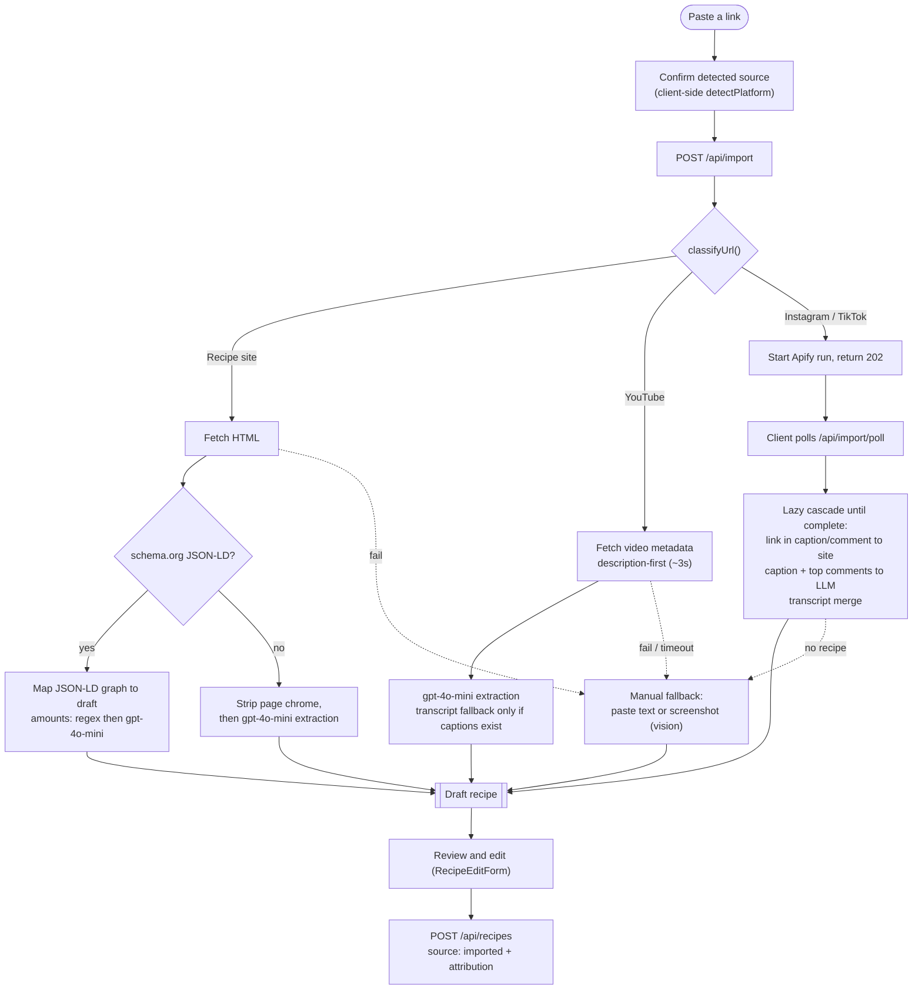

# 🍳 KitchenPal

> A personal recipe app where users build a private recipe vault — and an AI layer **imports**, generates, adapts, and discovers recipes on their behalf. The headline: **paste a link and KitchenPal pulls the recipe out of it.**

Built end-to-end with [Claude Code](https://claude.com/claude-code) 🤖 as the primary engineering collaborator — see [Agentic Workflow](#-agentic-workflow) below.

---

## ✨ Features

🗄️ **Vault** — searchable recipe catalog with full CRUD, manual creation, tag filtering, and a live **serving scaler** that rescales ingredient amounts proportionally (rendered as friendly fractions + abbreviated units, e.g. `1 1/2 tbsp`).

🤖 **AI generate & modify** — generate a recipe from a prompt (the **Generate** modal off the global “➕ Add Recipe”), or open any saved recipe in a side-by-side **Modify studio** (scale / dietary / simplify / substitute) that shows a **server-computed diff** of exactly what changed before you save a copy or replace the original.

🗓️ **Daily Rotation** — an “Ideas for tonight” row of recommendations, seeded from TheMealDB, normalized by AI into the app's schema, image-generated, and cached **per user per UTC day** (lazy — built on first visit, instant after).

🖼️ **Recipe images** — upload your own or generate one with AI (`gpt-image-1-mini`); stored in Supabase Storage with unguessable keys.

🍳 **Cook Mode** *(coming soon)* — a full-screen, hands-free cooking view (big type, step-aware sidebar, timer & read-aloud one tap away).

---

## 🤖 Agentic Workflow

This project was built as an exercise in agentic engineering. The headline shape:

- 📝 **Spec-first planning.** Planning sessions produced a full spec before implementation — user flows, architecture, data models, API routes, prompt design. The base spec ([.claude/plans/SESSION_2_SPEC.md](.claude/plans/SESSION_2_SPEC.md)) and the import feature spec ([.claude/plans/IMPORT_FEATURE_SPEC.md](.claude/plans/IMPORT_FEATURE_SPEC.md)) are the source of truth; the roadmap ([.claude/plans/SESSION_3_IMPLEMENTATION.md](.claude/plans/SESSION_3_IMPLEMENTATION.md)) breaks it into approvable stages.
- 🧑‍💻 **Claude Code drives implementation** through tailored instructions, plugins, and skills. [CLAUDE.md](CLAUDE.md) is the living **current-state + architecture** memory 🧠 and [.claude/DECISIONS.md](.claude/DECISIONS.md) is the dated decision log — every non-obvious trade-off, error pattern, and spec deviation is recorded so future sessions don't silently undo prior work.
- 🎨 **Figma MCP handles design handoff.** Frontend work reads screens and tokens directly from Figma; a custom [figma-translation](.claude/skills/figma-translation/) skill enforces component reuse and design-token discipline (no forked buttons, no hardcoded hex in JSX).
- 🔌 **Supabase MCP** gives the agent read-only inspection of the live DB during development. Schema changes still go through Prisma migrations.
- ✅ **Stage-by-stage approval.** Each stage is a self-contained, reviewable unit; the agent works one at a time, updates the memory files, and waits for go-ahead.

---

## 🏗️ Architecture at a glance

- 🔐 **Auth.** Supabase Auth (email + password, verification on). The client SDK holds the session; every backend request carries `Authorization: Bearer <jwt>`, verified by `authMiddleware`, which also `profile.upsert`s so a profile always exists. The **avatar lives in the auth `user_metadata`** (no DB column) so it rides in the session.
- 👥 **Tenancy.** App-layer only — every route scopes Prisma queries to `req.userId`. Supabase **RLS is intentionally off**; see CLAUDE.md for the reasoning and how to enable it safely.
- 🧠 **AI.** OpenAI **JSON mode** via a shared client (`callOpenAIJson` / `callOpenAIVisionJson`); 30s client timeout, import calls pass an explicit bounded timeout (single attempt). Model split: `gpt-4o-mini` (drafts, import extraction, vision) vs `gpt-4o` (full generation, modify, daily-rotation normalize). `generate-*` append the user's dietary prefs; `modify` returns `{ recipe, diff }` where the **diff is computed deterministically server-side** (`lib/diff.ts`), not by the LLM.
- 🗓️ **Daily rotation.** `GET /api/recommendations` lazily builds a per-user, per-UTC-day `DailyBatch` (TheMealDB → normalize LLM → image), cached thereafter.
- ⚡ **Frontend data layer.** A single `['recipes']` TanStack Query holds the per-user list; create/update/delete mutations are **optimistic** (apply → reconcile/rollback + toast). Catalog filtering/sorting is client-side over the cached list. Caches are warmed once per login.

## 📁 Project Structure

```
kp/
├── apps/
│   ├── api/                    # Express backend (one serverless function on Vercel)
│   │   ├── prisma/
│   │   │   ├── schema.prisma   # Profile · Recipe · DailyBatch
│   │   │   └── migrations/
│   │   └── src/
│   │       ├── app.ts          # Express app factory + route mounting
│   │       ├── index.ts        # Vercel serverless entry · dev.ts = local server
│   │       ├── routes/         # profile · recipes · ai · recommendations · import
│   │       ├── middleware/     # auth (JWT verify) · errors (HttpError)
│   │       ├── schemas/        # Zod schemas (source of truth for types)
│   │       ├── lib/            # openai · prisma · import + classify · sse · diff
│   │       │                   #   supadata (YouTube) · apify (IG/TikTok)
│   │       │                   #   image-provider · storage · prompts
│   │       └── tests/          # Vitest + supertest integration tests
│   └── web/                    # React + Vite frontend
│       └── src/
│           ├── routes/         # Auth · VerifyEmail · Home · Catalog · Account
│           │                   #   Settings · CookMode · Contact · Faq · Privacy · Terms
│           ├── components/     # atoms + composites (ImportModal, RecipeModal,
│           │                   #   ModifyStudio, AddRecipeChooser, ...)
│           ├── contexts/       # AuthContext · ToastContext · AddRecipeContext
│           ├── hooks/          # useRecipes · useRecommendations · useImagePicker · ...
│           ├── lib/            # apiFetch · queryClient · import · recipe · supabase
│           ├── types/          # API response shapes
│           └── index.css       # Tailwind v4 @theme tokens ("Culinary Serenity")
├── .claude/
│   ├── plans/                  # SESSION_2_SPEC · SESSION_3_IMPLEMENTATION · IMPORT_FEATURE_SPEC
│   ├── skills/                 # figma-translation/ (auto-fires on frontend tasks)
│   └── DECISIONS.md            # dated decision log (the "why")
├── CLAUDE.md                   # living memory: current state + architecture + gotchas
├── STARTUP.md                  # human prerequisites (Supabase, OpenAI, Supadata, Apify, Vercel)
└── package.json                # npm workspaces root
```


---

## 📥 Recipe Import

The flagship flow. A global **"➕ Add Recipe"** opens an import-first chooser with the URL field inline. Paste a link → confirm the detected source → **Extract**. The server classifies the URL and picks the cheapest extraction path that yields a complete recipe (**≥2 ingredients + ≥1 step**); any failure falls back to a manual paste / screenshot path. The draft is **never persisted by the import routes** — you review it in the shared editor and save it like any other recipe (`source: imported`, with creator/host attribution).



**How each source is handled**

- 🌐 **Recipe sites** — fetch the HTML, parse **schema.org `Recipe` JSON-LD** (walking `@graph`) into a KitchenPal draft; ingredient strings are parsed regex-first with a `gpt-4o-mini` fallback. No JSON-LD → strip the page chrome and run `gpt-4o-mini` extraction over the cleaned text.
- ▶️ **YouTube** — **description-first**: the recipe usually lives in the description, so we read the video metadata (~3s) and extract from it; the (slower) transcript is only attempted when captions actually exist — so caption-less Shorts fast-fail to the manual fallback instead of stalling. Channel name → creator attribution.
- 📸 **Instagram / TikTok** — scraped via **Apify**, run **asynchronously**: `/api/import` starts the run and returns a `runId`/`datasetId` (`202`), the client polls `/api/import/poll` (stateless — Apify holds the run), and on success the server runs a **lazy cascade** (link in caption/creator-comment → treat as a website · else caption + top comments → LLM · else transcript merge), stopping at the first complete recipe. The recipe usually sits in the IG pinned comment / TikTok description, so comments are authoritative over the transcript.
- ✍️ **Manual fallback** — offered automatically on any failure (`422`): **paste text** (`/api/import/text`, works for every platform) or **screenshot** (`/api/import/image` → `gpt-4o-mini` vision; the image is never stored).

**Live progress** — website/YouTube imports are synchronous and **stream real stages over SSE** (fetching → reading-structured | ai-extracting → parsing-ingredients; or fetching-transcript → transcribing → extracting); Instagram/TikTok report coarse stages (queued/scraping → extracting → done) through the poll. Service keys are **fail-soft** — a missing `SUPADATA_API_KEY` (YouTube/transcripts) or `APIFY_TOKEN` (IG/TikTok) disables only that source, not the whole feature.

---

## 🛰️ API surface

All routes are mounted under `/api` and require a Supabase JWT, except `/api/health`.

| Method     | Path                              | Purpose                                                     |
| ---------- | --------------------------------- | ----------------------------------------------------------- |
| 🟢 GET     | `/api/health`                     | Public liveness probe                                       |
| 🟢 GET     | `/api/profile`                    | Authenticated user's profile + email                        |
| 🟡 PUT     | `/api/profile`                    | Update display name / dietary preferences                   |
| 🔵 POST    | `/api/profile/avatar`             | Upload avatar image (client persists URL to `user_metadata`)|
| 🟢 GET     | `/api/recipes`                    | List the user's recipes (search/sort)                       |
| 🟢 GET     | `/api/recipes/:id`                | Fetch a single recipe                                       |
| 🔵 POST    | `/api/recipes`                    | Create a recipe (incl. imported drafts)                     |
| 🟡 PUT     | `/api/recipes/:id`                | Update a recipe                                             |
| 🔴 DELETE  | `/api/recipes/:id`                | Delete a recipe                                             |
| 🔵 POST    | `/api/recipes/:id/image/generate` | Generate a recipe image (AI, background)                    |
| 🔵 POST    | `/api/recipes/:id/image/upload`   | Upload a recipe image                                       |
| 🔴 DELETE  | `/api/recipes/:id/image`          | Remove a recipe image                                       |
| 🔵 POST    | `/api/ai/generate-drafts`         | 3 lightweight draft cards from input + preferences          |
| 🔵 POST    | `/api/ai/generate-full`           | Full recipe from a draft                                    |
| 🔵 POST    | `/api/ai/modify`                  | Modify a recipe → `{ recipe, diff }`                        |
| 🟢 GET     | `/api/recommendations`            | Lazy per-UTC-day daily rotation                             |
| 🔵 POST    | `/api/import`                     | Import from URL — **streams stages over SSE**               |
| 🔵 POST    | `/api/import/poll`                | Poll an async Instagram/TikTok (Apify) import               |
| 🔵 POST    | `/api/import/text`                | Extract a recipe from pasted text                           |
| 🔵 POST    | `/api/import/image`               | Extract a recipe from a screenshot (vision)                 |


---

## 💻 Local dev

### 📋 Prerequisites

Out-of-band setup (Supabase project, OpenAI key, optional Supadata/Apify/Figma/Vercel) lives in [STARTUP.md](STARTUP.md). Quick checklist:

1. 🟢 Node **22** and npm 9+ (Supabase's client needs a global `WebSocket`)
2. 🗄️ A Supabase project (URL, anon key, service key, DB connection strings, a public storage bucket)
3. 🧠 An OpenAI API key with access to `gpt-4o`, `gpt-4o-mini`, and an image model
4. 🔑 *(optional)* `SUPADATA_API_KEY` for YouTube imports, `APIFY_TOKEN` for Instagram/TikTok imports

### ⚙️ Setup

```bash
git clone <repo-url> kp && cd kp
cp .env.example .env                  # then fill in real values from STARTUP.md
npm install
npm run -w apps/api prisma:migrate    # apply migrations to your Supabase DB
npm run dev                           # 🚀 api on :3001, web on :5173 (proxied)
```

🌐 Open <http://localhost:5173>.

### 🧪 Useful scripts

| Command                                | What it does                                    |
| -------------------------------------- | ----------------------------------------------- |
| `npm run dev`                          | 🚀 Run api + web concurrently                   |
| `npm run build`                        | 📦 Build both packages                          |
| `npm run test`                         | 🧪 Run Vitest across both packages              |
| `npm run lint`                         | 🧹 ESLint over the workspace                    |
| `npm run format`                       | 🎨 Prettier write                               |
| `npm run -w apps/api prisma:migrate`   | 🧬 Create + apply a new migration               |
| `npm run -w apps/api prisma:studio`    | 🔍 Open Prisma Studio against the configured DB |

---

## 🔑 Environment variables

Single root `.env` shared by both apps via `dotenv-cli`. See `.env.example` for the template.

| Variable                  | Used by  | Purpose                                                       |
| ------------------------- | -------- | ------------------------------------------------------------- |
| `VITE_SUPABASE_URL`       | ⚛️ web   | Supabase project URL (client SDK)                             |
| `VITE_SUPABASE_ANON_KEY`  | ⚛️ web   | Supabase anon key (client SDK)                                |
| `SUPABASE_URL`            | 🛠️ api   | Supabase project URL (admin SDK)                              |
| `SUPABASE_SERVICE_KEY`    | 🛠️ api   | 🔒 Service-role key — backend only, never ship                |
| `SUPABASE_STORAGE_BUCKET` | 🛠️ api   | Public bucket name for recipe images + avatars                |
| `DATABASE_URL`            | 🛠️ api   | Prisma pooled connection (pgbouncer)                          |
| `DIRECT_URL`              | 🛠️ api   | Prisma direct connection (migrations)                         |
| `OPENAI_API_KEY`          | 🛠️ api   | 🧠 OpenAI API key (text + vision + image)                     |
| `IMAGE_PROVIDER`          | 🛠️ api   | Recipe-image generation provider/model selector              |
| `SUPADATA_API_KEY`        | 🛠️ api   | *(optional, fail-soft)* YouTube metadata + transcripts        |
| `APIFY_TOKEN`             | 🛠️ api   | *(optional, fail-soft)* Instagram / TikTok scraping           |

---

## 🚀 Deployment

▲ **One Vercel project.** The Vite SPA ships as static assets (`apps/web/dist`) and the entire Express app ships as a **single serverless function** (`api/index.ts`, which dynamic-imports the built ESM app). Runtime **Node 22**, `maxDuration: 60`. `vercel.json` rewrites `/api/(.*) → /api/index` with an SPA fallback for everything else.

The production database is the **same Supabase project as dev**, so the build step runs **`prisma generate` only** — migrations are applied locally (`prisma migrate dev`) against the shared cloud DB, *not* on deploy. All env vars above must be configured for **Production and Preview** (Supadata/Apify included, or those import sources silently disable).

**Workflow:** develop on `dev` → pushes auto-build protected Preview deployments; `main` is the promote-when-ready production branch. Full walk-through in [STARTUP.md](STARTUP.md).

---

## 🧰 Tech stack

<sub>(the boring-but-load-bearing bits)</sub>

- ⚛️ **Frontend** — React 18 + Vite 5, **Tailwind v4** (`@tailwindcss/vite`, no `tailwind.config`, tokens in `@theme`), React Router 6, TanStack Query 5
- 🛠️ **Backend** — Node 22 + Express 5 (ESM), one Vercel serverless function
- 🗄️ **Data / Auth / Storage** — Supabase (Postgres, email auth, file storage)
- 🧬 **ORM** — Prisma 6 (schema-as-code)
- 🧠 **AI & extraction** — OpenAI (`gpt-4o` / `gpt-4o-mini` / vision / `gpt-image-1-mini`), Supadata (YouTube), Apify (IG/TikTok), TheMealDB (daily rotation)
- ✅ **Validation** — Zod as the single source of truth; TS types via `z.infer`
- 🧪 **Testing** — Vitest + supertest (backend integration)
- 🧹 **Tooling** — npm workspaces, ESLint v9 flat config, Prettier, `dotenv-cli` (one root `.env`)

---

## 🗺️ Roadmap

- 🍳 **Cook Mode** — wire up the dedicated cooking screen (currently a coming-soon preview)
- 🛡️ Rate limiting and per-user usage tracking
- 🥗 Nutrition estimation via a follow-up AI call, stored alongside the recipe
- 🥫 Pantry mode — generation/modification constrained to ingredients on hand
- 🕰️ Recipe versioning — every AI modification creates a revertable version row
- ⚙️ Real Settings controls

---

## 📚 Further reading

- 🧠 [CLAUDE.md](CLAUDE.md) — living memory: current state, architecture, error patterns
- 🗒️ [.claude/DECISIONS.md](.claude/DECISIONS.md) — dated decision log (the "why")
- 🚀 [STARTUP.md](STARTUP.md) — human prerequisites the agent can't do
- 📝 [.claude/plans/SESSION_2_SPEC.md](.claude/plans/SESSION_2_SPEC.md) — product + technical spec
- 📥 [.claude/plans/IMPORT_FEATURE_SPEC.md](.claude/plans/IMPORT_FEATURE_SPEC.md) — the import feature, as built
- 🎨 [.claude/skills/figma-translation/SKILL.md](.claude/skills/figma-translation/SKILL.md) — frontend reuse + token discipline gate
